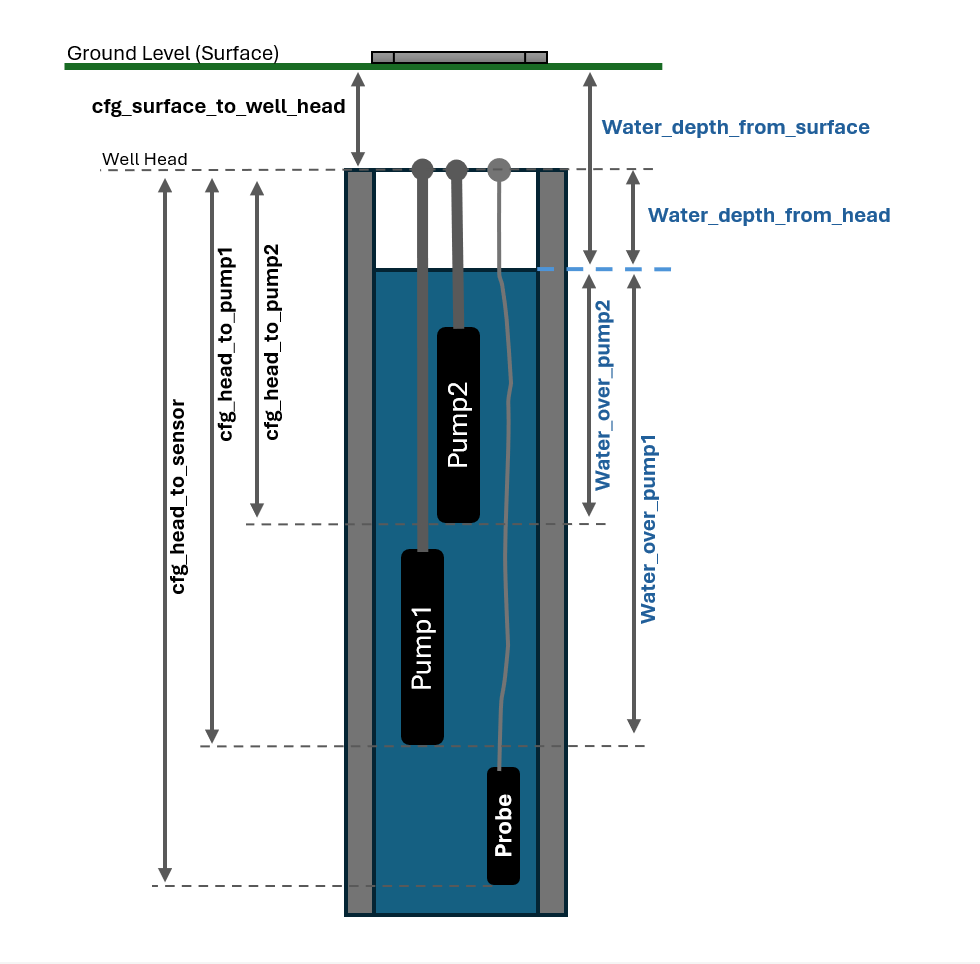

# Well Water Level Monitoring (TL‑136 + ESP8266/ESP32 + ESPHome)

Monitor a well (e.g. heat‑pump supply) with a 4–20 mA TL‑136 submersible pressure sensor and an
ESP8266 D1 mini running ESPHome. Data flows into Home Assistant for visualization, alerts, and
level-based automation (e.g. heat pump interlocks). Designed for reliability, easy calibration, and
low long-term power drain.

## Table of Contents
- [Overview](#overview)
- [Hardware Setup](#hardware-setup)
- [Software](#software)
- [Configuration](#configuration)
- [Diagnostics & Entities](#diagnostics--entities)
- [Reference](#reference)
- [License](#license)

---
## Overview
- Purpose: reliable well water level tracking with low power usage.
- Power-saving: deep sleep by default (30 s active / 10 min sleep).
- OTA-friendly: deep sleep can be disabled from Home Assistant.
- Flexible setup: all geometry, calibration, and filtering are configurable from HA (no reflashing).
- Safety: error sensor flags implausible shunt voltage range.
 - Controlled wake cycle: 2 s stabilization + 5 s high‑rate sampling (~2 Hz) then a single gated publish.
- Publish gating: user‑facing depth and derivative sensors output only after the burst completes (reduces early wake noise).
- Maintenance & diagnostics modes: "Stay Awake" (auto‑off after 30 min) and "Burst Mode" (continuous wake, 30 min auto‑off) switches prevent deep sleep for OTA or rapid observation.

<p align="center">
  
</p>

What you get
- Sensor power only when needed (relay switches the 24 V supply)
- Two‑point linear calibration (mA → depth), with robust fallback
- Exponential moving average filtering and warmup handling
- User‑facing level entities plus diagnostics for troubleshooting

Quick start (5 steps)
1) Assemble hardware (choose wiring option) and share grounds as indicated.
2) Create `secrets.yaml` with Wi‑Fi (and optional `ota_password`).
3) Run local validation scripts to catch issues early.
4) Add `waterlevel-sensor.yaml` in ESPHome; flash via USB once, then OTA.
5) In Home Assistant, set geometry, shunt value, filter window, then perform two‑point calibration.

---
## Hardware Setup
Core parts
- Sensor: TL‑136, 0–5 m, 4–20 mA, 24 V
- Controller: ESP8266 D1 mini (ESPHome)
- Relay: 1‑channel 5 V module (switches +24 V to the sensor)
- Shunt: 150 Ω (≥0.25 W) in return path (loop current → voltage)
- Power: 24 V (sensor) and 5 V (ESP + relay)

High‑side switching (DEFAULT)
- Relay disconnects the 5 V feed going into the 24 V boost converter (or directly the +24 V sensor line if using a fixed 24 V supply).
- Result: when off, the converter + sensor draw virtually zero current; ADC reference remains solid because grounds stay tied.
- Recommended for stability and clean measurements.

Quick wiring (high‑side 5 V feed)
```text
5V supply → Relay COM → Relay NO → Boost Vin+ → Boost 24V+ → Sensor (+)
Sensor (−) → Shunt (150 Ω) → 24V GND → MCU GND
A0 ← measurement point (top of shunt) through mandatory 1 kΩ series resistor
Relay module: IN ← D5 (GPIO14), VCC ← 5V supply, GND ← MCU GND
Optional: 100 nF–1 µF from measurement point to GND (analog low‑pass)
```

Series protection & filtering (now mandatory)
- 1 kΩ series resistor before A0 (overvoltage & transient protection)
- 100 nF–1 µF capacitor measurement point → GND (noise reduction)

Alternative wiring (low‑side switching)
- Relay opens the negative/ground path of the boost converter.
- Pros: eliminates even the boost converter’s quiescent draw.
- Cons: floating measurement node when open → requires pulldown + filtering, slightly higher risk of noise.

Low‑side additional parts
- Add 470 kΩ–1 MΩ pulldown from measurement node to MCU GND.
- Keep the same 1 kΩ series resistor and 100 nF–1 µF capacitor.

Full diagrams are in [ASCII Wiring Diagrams](#ascii-wiring-diagrams).

---
## Software
ESPHome device: `waterlevel-sensor.yaml` (ESP8266 D1 mini)

Local testing (before flashing)

Windows (PowerShell)
```powershell
./scripts/test-local.ps1
```

Linux/macOS (Bash)
```bash
chmod +x scripts/test-local.sh
./scripts/test-local.sh
```

These scripts lint Markdown/YAML, validate the ESPHome configuration, and can compile firmware. Ensure a `secrets.yaml` exists (see below).

Build & flash
1) Add the YAML to your ESPHome dashboard.
2) First flash via USB; subsequent updates use OTA.
3) For CI releases, tags trigger packaging in GitHub Actions (optional).

Minimal secrets.yaml

```yaml
wifi_ssid: "YourNetworkName"
wifi_password: "YourPassword"
ap_password: "APFallbackPassword"
# If configured in YAML: ota_password: "YourOTAPassword"
```

---
## Configuration
All parameters appear as Home Assistant `number` entities (`entity_category: config`). Values
persist across deep sleep.

- Geometry numbers: `cfg_surface_to_well_head` (surface ↓ head, positive), `cfg_head_to_sensor`,
  `cfg_head_to_pump1`, `cfg_head_to_pump2`, `cfg_head_to_bottom` (informational)
- Filtering window (s): `cfg_filter_window_s`
- Calibration points: `cfg_cal1_*`, `cfg_cal2_*` (currents + depths)
- Shunt resistance (Ω): `cfg_shunt_resistance_ohm`
- Sensor span (m): `cfg_sensor_span_m` (factory 5.0 m for TL‑136; change when using a different
        range sensor)

Depth semantics
- "Depth Below Head" (`water_depth_from_head`) is distance from the well head downward to the
        current water surface.
- "Depth Below Surface" (`water_depth_from_surface`) = Depth Below Head + Surface→Head (the fixed
        offset `cfg_surface_to_well_head`).
- Positive values mean the water surface lies below the reference (head or ground surface).
        Invalid / unavailable readings publish as no value (NaN).

## Calibration (Quick Guide)

### Collecting Measurements (Before Calibration)
Gather these physical measurements once; they define geometry and feed calibration:
1. Surface → Well Head (`cfg_surface_to_well_head`): Vertical distance from ground surface down to the well head (positive; e.g. 1.00 m if head is 1 m below surface).
2. Well Head → Sensor (`cfg_head_to_sensor`): Depth of sensor below well head, usually the submerged cable length minus any slack at the top.
3. Well Head → Pump(s) (`cfg_head_to_pump1`, `cfg_head_to_pump2`): Vertical distance from the well head down to each pump intake (for “Over Pump” height calculations).
4. Well Head → Bottom (`cfg_head_to_bottom`, optional informational): Depth from well head to bottom of well; not used in current calculations.
5. Shunt Resistance (`cfg_shunt_resistance_ohm`): Measure actual resistor value with power off; tolerance matters for current accuracy.
6. Sensor Span (`cfg_sensor_span_m`): Factory range of the pressure sensor (TL‑136 default 5.0 m). Change only if you use a different range probe.

### Calibration Strategy
You need two known (current, depth) pairs referenced to the well head. Depths are always “Depth Below Head”.
- Point 1 (Near Dry): Water surface at sensor top. Depth Below Head ≈ `head_to_sensor`. Loop current typically ≈ 4.00 mA.
- Point 2 (Full Span or Known Higher Level): Water column above sensor near the top of sensor’s rated span. For span = 5 m and `head_to_sensor` = 5 m: Depth Below Head ≈ 0.0 m; loop current ≈ 20.00 mA.

If you cannot obtain full span, choose any second stable level significantly different from Point 1 and record its loop current and depth. Ensure:
- Current difference > 0.1 mA
- Depth difference > 0.01 m

Enter values into `cfg_cal1_current_mA`, `cfg_cal1_depth_m`, `cfg_cal2_current_mA`, `cfg_cal2_depth_m`.

Range constraint (enforced in firmware)
- Valid calibration depths must be within the sensor’s measurable “Depth Below Head” range:
	`[ head_to_sensor - sensor_span , head_to_sensor ]`.
- If any calibration depth is outside this range, the calibration is ignored and the fallback curve is used.

Fallback behavior
- If calibration is invalid (bad values or too close), firmware falls back to the theoretical span curve:
	Depth Below Head = (`head_to_sensor`) − (ColumnAboveSensor).

### Worked Example (Your Setup)
Assumptions
- Well head is 1.20 m below the surface ⇒ `cfg_surface_to_well_head = 1.20` m.
- Sensor is 6.00 m below the well head ⇒ `cfg_head_to_sensor = 6.00` m.
- Sensor span is 5.00 m (TL‑136 default) ⇒ `cfg_sensor_span_m = 5.00` m.

Measurable depth range (from well head)
- Min depth = 6.00 − 5.00 = 1.00 m; Max depth = 6.00 m.
- Calibration depths must be within [1.00 m , 6.00 m].

Choose calibration points
- Point 1 (near dry): water just at sensor → Depth Below Head = 6.00 m, Current ≈ 4.00 mA.
- Point 2 (near full span): ≈ 5 m water over sensor → Depth Below Head = 1.00 m, Current ≈ 20.00 mA.

Enter into HA
- `cfg_cal1_current_mA = 4.00`, `cfg_cal1_depth_m = 6.00`
- `cfg_cal2_current_mA = 20.00`, `cfg_cal2_depth_m = 1.00`

Cross‑checks
- Depth Below Surface = Depth Below Head + `cfg_surface_to_well_head` (add 1.20 m to the above
        depths if you want surface‑referenced values).
- If you pick a different second point (not full span), ensure it still lies between 1.00 m and
        6.00 m and its current is stable.

### Recommended Order
1. Set geometry numbers.
2. Set shunt resistance & sensor span.
3. Let the device run; confirm stable loop current.
4. Enter calibration point 1.
5. Wait for a distinct water level change (or fill) and enter point 2.
6. Verify Depth sensors show plausible values vs manual measurement.

<!-- Removed older quick guide in favor of the structured Calibration section above -->

Defect / disconnect detection
- Readings with loop current < 4 mA (below nominal 4–20 mA range) are treated as invalid and user-facing level sensors publish no value (suppressed as NaN).

Filtering & warmup

```text
avg = avg + alpha * (raw - avg)
alpha = dt / window_s     (dt = update period)
```

Warmup suppresses the first few publishes to avoid skewed initial values.

### Kalman filtering notes
- `water_depth_from_head_kalman` filters only the computed depth (meters) from the well head.
- `water_depth_from_surface_kalman` is derived as a template: `head_kalman + cfg_surface_to_well_head`.
- Rationale: Kalman is translation-invariant; adding a constant offset after filtering is mathematically equivalent to filtering the offset signal, avoids double-filtering/extra lag, and instantly reflects runtime changes to the surface→head offset.

Tuning (practical starting points)
- Defaults (good first try): `process_std_dev = 0.05 m`, source `error = 0.02 m` (already set in YAML).
- Typical well setups:
        - `process_std_dev`: 0.02–0.10 m per update for smooth, realistic tracking.
        - Source `error` (measurement noise): 0.01–0.05 m.
- Faster tracking (pumping/off events, steep changes):
        - Increase `process_std_dev` to 0.10–0.30 m.
        - If small jitter leaks through, raise source `error` slightly (e.g., 0.03–0.05 m) or increase the EMA window.
- Very stable aquifer/noisy sensor already EMA-smoothed:
        - Decrease `process_std_dev` toward 0.01–0.03 m; keep `error` near measured noise (often ~0.01–0.03 m).
- Choosing values empirically:
        - Observe a stable period: set source `error` ≈ std‑dev of `Depth Below Head (Raw)` during that period.
        - Observe a rapid change (pump run): if Kalman lags noticeably behind `Raw`, increase `process_std_dev` a step.
- Update interval note: parameters are “per update”. If you change `sensor_update_sec`, re‑tune; longer intervals generally need a larger `process_std_dev` to keep responsiveness.

Deep sleep
- Typical cycle: wake → energize sensor → measure → publish → power off → sleep.
- Toggle “Deep Sleep Disable” in HA to keep the device awake for OTA/debugging.
- High‑rate sampling phase: On boot a 2 s stabilization delay runs before a 5 s burst at 500 ms intervals (~2 Hz, below sensor response limit). Internally the raw chain (`shunt_adc_raw`, `shunt_voltage`, `loop_current_raw`, `loop_current_filtered`, `well_depth_raw`) is force‑updated each interval. After the burst the script sets `publish_ready = true` and depth sensors begin emitting values.
- Single publish gating: Until `publish_ready` is set, user‑facing depth sensors return `NaN` (hidden), avoiding transient initialization data.
- Burst Mode: When the `burst_mode` switch is ON deep sleep is prevented after the cycle; repeated cycles continue until auto‑off (30 min) or manual disable.
- Auto‑off safeguards: Both `Stay Awake` (`deep_sleep_disable`) and `Burst Mode` switches start a 30‑minute timer script on activation; if still ON they are turned OFF automatically and normal deep sleep resumes.
- Sleep duration configuration: A `cfg_sleep_duration_min` number entity is present for future dynamic sleep tuning (currently fixed at 10 min in `deep_sleep:` block; can be wired to scripted entry later).

Installation checklist
1. Build hardware; share ground between 24 V and 5 V rails.
2. Create `secrets.yaml` and validate locally (scripts above).
3. Add `waterlevel-sensor.yaml` to ESPHome and flash.
4. In HA, set geometry, shunt resistance, filter window, then perform calibration.

---
## Diagnostics & Entities
User‑facing sensors
- `water_depth_from_head` (Depth Below Head)
- `water_depth_from_head_kalman` (Depth Below Head — Kalman)
- `water_depth_from_surface` (Depth Below Surface)
- `water_depth_from_surface_kalman` (Depth Below Surface — Kalman)
- `water_over_pump1` (Over Pump 1)
- `water_over_pump2` (Over Pump 2)
- `loop_current_filtered` (Loop Current)

Diagnostic (internal) entities
- `shunt_adc_raw` (ADC Internal 0–1 V raw)
- `shunt_voltage` (ADC × 3.2 scaling to actual shunt voltage)
- `loop_current_raw` (raw loop current mA)
- `sensor_column_filtered_m` (filtered water column above sensor)
- `loop_current_filtered` (filtered loop current, user-facing)

Error detection
- `binary_sensor.water_sensor_error` → TRUE if implausible shunt voltage (< 0.05 V or > 3.2 V). 10 s delayed ON/OFF to ignore spikes.

Switches
- `sensor_power` (Sensor Power)
- `deep_sleep_disable` (Stay Awake)
- `burst_mode` (Burst Mode – forces continuous cycles, auto‑off 30 min)

Configuration numbers (prefix omitted in HA UI display name)
- `cfg_surface_to_well_head`, `cfg_head_to_sensor`, `cfg_head_to_pump1`, `cfg_head_to_pump2`, `cfg_head_to_bottom`
- `cfg_filter_window_s`, `cfg_cal1_current_mA`, `cfg_cal1_depth_m`, `cfg_cal2_current_mA`, `cfg_cal2_depth_m`
- `cfg_shunt_resistance_ohm`, `cfg_sensor_span_m`

---
## Reference
See full configuration: `waterlevel-sensor.yaml`.

Filtering, calibration, and error logic are implemented via template sensors in the main file.

### ASCII Wiring Diagrams

High‑side wiring (default — switching 5 V feed to boost)
```
                            HOUSE / BASEMENT
                    ┌─────────────────────────────────────┐
                    │                                     │
                    │  5V SUPPLY / USB                    │
                    │      +5V ───┐                       │
                    │             │                       │
                    │         ┌───┴───────┐               │
                    │         │  RELAY    │ (1‑ch, 5 V)   │
                    │         │  COM      │               │
                    │         │           │               │
                    │         │  NO ────────────► Boost Vin+ ───► 24V+ ─── Cable 1 ───► Sensor (+)
                    │         └───────────┘               │
                    │             │                       │
                    │            GND ─────────────────────┬───────────────┐
                    │                                     │               │
                    │                             150 Ω shunt             │
                    │                        (≥0.25 W)  ┌───────┐         │
                    │                                   │       │         │
                    │  Sensor (−) ── Cable 2 ───────────┘       │         │
                    │                                           ▼         │
                    │                                Measurement node     │
                    │                                | | 1 kΩ series → A0 │
                    │                                | | 100 nF–1 µF → GND│
                    │                                                GND  │
                    │          D1 MINI (ESP8266)                       │  │
                    │      5V_in  ◄─────────────── (same +5V)          │  │
                    │      GND    ─────────────────────────────────────┘  │
                    │      D5 (GPIO14) ─────► Relay IN                      │
                    │      5V          ─────► Relay VCC                     │
                    │      GND         ─────► Relay GND                     │
                    └─────────────────────────────────────┘

                            WELL SHAFT
                    ┌─────────────────────────────────────┐
                    │        TL‑136 LEVEL SENSOR          │
                    │      (+)  ◄────────── Cable 1       │
                    │      (−)  ───────────► Cable 2      │
                    └─────────────────────────────────────┘
```

<details>
<summary>Low‑side wiring (alternative) — click to expand</summary>

```
                                        HOUSE / BASEMENT
                    ┌─────────────────────────────────────┐
                    │                                     │
                    │            24V SUPPLY               │
                    │                                     │
                    │      +24V ──────┐                   │
                    │                 │                   │
                    │                 │      RELAY MODULE │
                    │                 │      (1-ch, 5 V)  │
                    │                 │                   │
                    │             ┌───┴───────┐           │
                    │             │   COM     │           │
                    │             │           │           │
                    │             │   NO ───────────── Cable 1 ─────► down to well
                    │             │           │           │
                    │             └───────────┘           │
                    │                 │                   │
                    │                GND ──────┐          │
                    │                          │          │
                    │        SHUNT 150 Ω       │          │
                    │         (≥0.25 W)        │          │
                    │                          │          │
                    │   24V-GND ──────┤◄───[ R_shunt ]─── Cable 2 ◄──── from well
                    │                          │
                    │                          └───► Measurement point → D1 mini A0
                    │                                     │
                    │                                     │
                    │          D1 MINI (ESP8266)          │
                    │                                     │
                    │     5V_in  ◄── 5V supply / USB      │
                    │     GND    ──────────────┬──────────┘
                    │                          │ (shared ground with 24V-GND)
                    │     A0   ◄───────────────┘ (top end of shunt)
                    │
                    │     D5 (GPIO14) ─────► Relay IN
                    │     5V          ─────► Relay VCC
                    │     GND         ─────► Relay GND
                    │
                    └─────────────────────────────────────┘

                                        WELL SHAFT
                    ┌─────────────────────────────────────┐
                    │                                     │
                    │        TL-136 LEVEL SENSOR          │
                    │                                     │
                    │      (+)  ◄────────── Cable 1       │
                    │      (-)  ───────────► Cable 2      │
                    │                                     │
                    └─────────────────────────────────────┘
```

</details>

---
## License
License: See `LICENSE`.

Disclaimer: Use at your own risk. Handle higher‑voltage supplies safely. Ensure waterproof integrity of downhole cabling. Contributions welcome!
